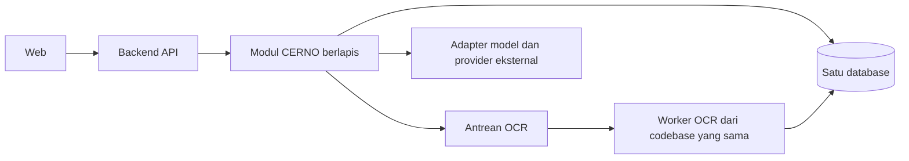

# Dokumen Keputusan Arsitektur CERNO

| Identitas dokumen | Keterangan |
|---|---|
| Proyek | CERNO — *Bedakan sebelum percaya* |
| Jenis | Rancangan arsitektur aplikasi dan catatan keputusan |
| Status | Dokumen kerja; belum seluruh keputusan disahkan |
| Versi | 0.13 |
| Tanggal pembaruan | 25 September 2026 |

> Dokumen ini menjadi sumber konteks arsitektur selama diskusi dan implementasi. Pernyataan berstatus **ditetapkan** berasal dari ruang lingkup produk atau ketentuan proyek yang sudah tercatat. **Usulan** adalah arah rancangan yang masih dapat berubah. **Terbuka** berarti membutuhkan keputusan atau pembuktian. Teknologi yang disebut dalam usulan belum berarti sudah diimplementasikan.

## Ringkasan

CERNO adalah aplikasi web pendukung keputusan untuk menilai risiko pesan, URL, dan screenshot percakapan mencurigakan berbahasa Indonesia. Keluaran analisis berupa tingkat risiko, skor, bukti yang dapat dijelaskan, keterbatasan pemeriksaan, dan rekomendasi tindakan. Analisis dasar dapat dipakai tanpa akun; akun diperlukan untuk riwayat pribadi. Laporan anonim dimoderasi sebelum menjadi sinyal komunitas.

**Bentuk arsitektur yang dipilih:** *modular monolith* berlapis, dengan komunikasi langsung antarmodul untuk alur biasa dan antrean serta worker untuk OCR. Satu database relasional dipakai bersama, tetapi tiap modul memiliki tanggung jawab atas tabelnya. Pilihan framework, provider, dan layanan Azure masih terbuka.

## 1. Kebutuhan dan batasan

### 1.1 Tujuan sistem

CERNO membantu pengguna mengambil keputusan sebelum mengeklik tautan, memberikan informasi sensitif, atau bertransaksi. Sistem memberi indikasi risiko beserta alasan dan langkah aman berikutnya. Hasil tidak dinyatakan sebagai jaminan aman, vonis penipuan, atau putusan hukum. **Status: ditetapkan.**

### 1.2 Pengguna dan hak dasar

| Aktor | Kebutuhan utama | Status |
|---|---|---|
| Pengunjung | Menganalisis teks, URL, dan screenshot; melihat hasil; memberi feedback; mengirim laporan anonim | Ditetapkan |
| Pengguna berakun | Semua kemampuan pengunjung, ditambah menyimpan, melihat, dan menghapus riwayat pribadi | Ditetapkan |
| Admin | Meninjau dan memoderasi laporan komunitas, meninjau feedback, serta memantau penggunaan, kesehatan layanan, dan informasi versi/performa model | Ditetapkan berdasarkan keputusan tim 24 September 2026 |

### 1.3 Kebutuhan fungsional

| ID | Kebutuhan | Implikasi arsitektur | Status |
|---|---|---|---|
| KF-01 | Analisis teks pesan berbahasa Indonesia | Jalur input teks, model/sinyal risiko, dan penjelasan hasil | Ditetapkan |
| KF-02 | Ekstraksi URL dari teks dan analisis URL yang dikirim langsung | Normalisasi URL dan pemeriksaan sinyal URL | Ditetapkan |
| KF-03 | Pemeriksaan reputasi URL melalui provider jika digunakan | Batas integrasi eksternal dan status hasil ketika provider gagal | Ditetapkan pada tingkat kebutuhan; provider terbuka |
| KF-04 | Analisis screenshot melalui OCR | Upload sementara, proses OCR, dan status pekerjaan | Ditetapkan |
| KF-05 | Pengguna meninjau dan dapat mengoreksi teks OCR sebelum analisis final | Alur dua tahap; OCR tidak langsung menghasilkan penilaian final | Ditetapkan |
| KF-06 | Hasil berisi tingkat risiko, skor, bukti, keterbatasan, dan rekomendasi | Kontrak hasil yang stabil dan dapat ditelusuri | Ditetapkan |
| KF-07 | Riwayat pribadi berdasarkan persetujuan pengguna | Autentikasi, otorisasi per pemilik, dan kebijakan retensi | Ditetapkan |
| KF-08 | Feedback terhadap hasil analisis | Penyimpanan feedback terpisah dari label pelatihan | Ditetapkan |
| KF-09 | Laporan anonim dan moderasi | Redaksi, deduplikasi, pembatasan penyalahgunaan, serta audit moderasi | Ditetapkan |
| KF-10 | Dashboard operasional dan model untuk admin | Metrik layanan, antrean, dan versi model | Ditetapkan |

### 1.4 Kebutuhan kualitas

| Aspek | Kebutuhan awal | Ukuran/keputusan lanjutan | Status |
|---|---|---|---|
| Privasi | Pesan dan screenshot mentah tidak menjadi riwayat secara otomatis; penyimpanan riwayat memerlukan persetujuan dan redaksi | Data anonim/OCR sementara maksimal 24 jam; riwayat tersimpan 30 hari atau sampai dihapus lebih awal; laporan, feedback, dan log masih terbuka | Prinsip dan batas analisis/riwayat ditetapkan |
| Kejelasan hasil | Bukti dan rekomendasi ditampilkan bersama skor; sinyal komunitas dan keterbatasan pemeriksaan dibedakan | Bentuk kontrak hasil dan evaluasi pemahaman pengguna | Prinsip ditetapkan; ukuran terbuka |
| Ketahanan integrasi | Kegagalan provider reputasi tidak boleh ditafsirkan sebagai URL aman | Timeout, percobaan ulang, dan representasi hasil parsial | Prinsip ditetapkan; mekanisme terbuka |
| Keamanan | Akses riwayat dibatasi ke pemilik; seluruh fungsi moderasi dan administrasi hanya dapat diakses Admin | Mekanisme autentikasi, pembatasan permintaan, dan audit | Prinsip ditetapkan; teknologi terbuka |
| Keterlacakan | Hasil dapat dikaitkan dengan versi model dan bukti yang dipakai | Format versi, metadata, dan perubahan model | Prinsip ditetapkan; detail terbuka |
| Kinerja | Analisis harus cukup cepat untuk membantu keputusan pengguna | Target latensi berdasarkan uji dan kebutuhan demo/publik | Terbuka |
| Biaya dan operasi | Solusi harus layak dikerjakan dan dijalankan oleh tim kecil | Kuota, biaya, dan layanan Azure yang tersedia | Terbuka |

### 1.5 Batasan proyek

| Batasan | Dampak pada rancangan | Status |
|---|---|---|
| Tim terdiri dari tiga orang dan proyek dikerjakan dalam satu semester | Jumlah layanan dan beban operasi perlu dijaga proporsional | Ditetapkan |
| Produk akhir akan di-*deploy* pada akun Azure departemen untuk *showcase* | Rancangan deployment harus kompatibel dengan sumber daya akun tersebut | Ditetapkan oleh modul praktikum; layanan dan kuota terbuka |
| Prototipe wireframe saat ini dibuat dengan Next.js | Dapat menjadi dasar frontend; belum mengunci pilihan backend atau deployment akhir | Fakta repo; keputusan penggunaan ulang terbuka |
| AI, jaringan, dan komputasi awan merupakan bagian dari solusi yang diajukan | Arsitektur harus menunjukkan kontribusi dan integrasi ketiganya | Ditetapkan pada konsep proyek |

### 1.6 Batas ruang lingkup

CERNO tidak dirancang untuk klasifikasi jenis scam, *public accusation feed*, integrasi WhatsApp langsung, atau *live website crawling*. Pemeriksaan URL berfokus pada karakteristik URL dan sumber reputasi yang dipilih; URL dari pengguna tidak boleh dibuka atau diikuti begitu saja oleh server. Laporan komunitas bukan bukti tunggal untuk menetapkan risiko tinggi. **Status: ditetapkan pada rancangan produk saat ini.**

### 1.7 Pertanyaan yang perlu dijawab sebelum mengunci arsitektur

1. Target minimal yang tertulis pada modul adalah *showcase* di Azure departemen. Apakah aplikasi juga akan dibuka untuk masyarakat umum? Jawaban memengaruhi kapasitas, kontrol penyalahgunaan, dan operasi.
2. Layanan dan kuota apa yang tersedia pada akun Azure departemen?
3. Berapa ukuran dan jenis screenshot yang akan diterima, serta target waktu OCR yang dianggap layak?
4. Apakah layanan Azure departemen memungkinkan penerapan kebijakan retensi pada Bagian 4.3–4.6, khususnya screenshot sementara, backup, dan pembersihan terjadwal?
5. Apakah ada pembatasan pengiriman pesan, URL, atau screenshot ke provider eksternal?

## 2. Gaya arsitektur dan alasan

**Status: ditetapkan oleh tim pada 25 September 2026.** Keputusan ini menjelaskan beberapa sisi arsitektur yang berbeda, bukan beberapa nama untuk pola yang sama.

| Sisi arsitektur | Pilihan CERNO | Makna praktis |
|---|---|---|
| Bentuk aplikasi | **Modular monolith** | Satu backend/codebase yang dibagi menjadi modul kemampuan produk; bukan kumpulan microservice. |
| Struktur internal | **Layered per modul** | Tiap modul memisahkan API, logika aplikasi, aturan domain, dan infrastruktur. Arah dependensi dijaga agar aturan domain tidak bergantung langsung pada framework atau provider. |
| Komunikasi utama | **Request–response dan panggilan modul langsung** | Analisis teks/URL serta fungsi akun, riwayat, dan admin berjalan melalui permintaan API; modul berinteraksi lewat antarmuka yang jelas. |
| Pekerjaan latar belakang | **Asinkron berbasis antrean untuk OCR** | API membuat pekerjaan OCR; worker dari codebase yang sama mengambil pekerjaan dan menyimpan status/hasil untuk ditinjau pengguna. Ini bukan event-driven menyeluruh. |
| Data | **Satu database dengan kepemilikan per modul** | Transaksi dan operasi database tetap sederhana, tetapi hanya modul pemilik yang mengubah tabelnya; modul lain memakai antarmukanya. |
| Integrasi luar | **Adapter pada lapisan infrastruktur** | Model dan provider eksternal diakses lewat antarmuka internal agar pilihan vendor dapat berubah tanpa mengubah aturan domain. Detail antarmuka diputuskan saat kontrak integrasi dibahas. |

Alasan utama pilihan ini ialah menjaga batas tanggung jawab sekaligus membatasi beban deployment dan operasi bagi tim tiga orang. Microservices penuh dan alur event-driven menyeluruh tidak diperlukan untuk alur utama saat ini. Konsekuensinya, batas modul harus ditegakkan dalam struktur kode dan review agar aplikasi tidak berubah menjadi satu kumpulan fungsi yang saling mengakses data secara bebas.

Diagram ini menunjukkan bentuk logis. Jumlah proses/container, produk antrean, dan layanan hosting belum dipilih.

## 3. Komponen dan alur utama

**Status: batas modul dan kontrak tingkat arsitektur ditetapkan; skema request/response rinci belum diputuskan.**

### 3.1 Modul utama

| Modul | Tanggung jawab awal |
|---|---|
| Analisis | Validasi input, orkestrasi sinyal, penghitungan hasil, bukti, dan rekomendasi |
| Pemeriksaan URL | Ekstraksi/normalisasi URL, karakteristik URL, dan integrasi reputasi |
| OCR | Menerima screenshot sementara, mengelola pekerjaan OCR, menyediakan teks untuk review |
| Akun dan riwayat | Identitas, hak akses, persetujuan penyimpanan, daftar/detail/penghapusan riwayat |
| Komunitas dan admin | Laporan anonim, deduplikasi, keputusan moderasi oleh Admin, sinyal komunitas, metrik operasional, feedback, dan informasi versi model |

Modul berkomunikasi melalui fungsi/antarmuka yang dinyatakan jelas. Pemanggilan langsung dipakai untuk alur biasa; pengiriman pekerjaan ke antrean khusus dipakai untuk OCR. Masing-masing modul memiliki tabelnya dalam database yang sama. Rincian antarmuka dan pemetaan tabel ke modul masih akan ditentukan bersama kontrak API dan rancangan data fisik.

### 3.2 Alur yang harus digambar dan diperiksa

1. **Teks/URL:** input → validasi dan redaksi → analisis sinyal relevan → hasil dan rekomendasi.
2. **Screenshot:** upload sementara → OCR → review/koreksi oleh pengguna → analisis final → penghapusan file sesuai retensi.
3. **Riwayat:** hasil → persetujuan penyimpanan → data teredaksi → akses/penghapusan oleh pemilik.
4. **Laporan:** kirim anonim → redaksi dan deduplikasi → moderasi → sinyal komunitas yang dibatasi bobotnya.

Diagram konteks, komponen, urutan alur utama, dan deployment akan ditambahkan setelah batas komponen dibahas. Diagram ERD yang sudah ada menggambarkan rancangan data logis, bukan bukti bahwa database telah dibangun.

### 3.3 Kontrak antarmodul tingkat arsitektur

**Status: ditetapkan oleh tim pada 25 September 2026.**

| Pemanggil | Modul/adapter yang dipanggil | Masukan dan keluaran konseptual |
|---|---|---|
| Web → Analisis | Modul Analisis | Input final teks/URL atau teks screenshot yang sudah ditinjau → hasil risiko dan rekomendasi |
| Analisis → URL | Modul Pemeriksaan URL | URL yang diekstrak/dikirim → karakteristik, reputasi, bukti, dan status pemeriksaan |
| Analisis → Komunitas dan Admin | Antarmuka baca sinyal komunitas | Target ternormalisasi → sinyal dari laporan yang sudah dimoderasi; tanpa akses langsung ke tabel laporan |
| Analisis → model | Adapter inferensi | Input/sinyal yang diperlukan → skor/sinyal model dan versi model; detail provider tersembunyi di lapisan infrastruktur |
| Web → OCR | Modul OCR | Screenshot → pekerjaan OCR; kemudian status dan teks hasil untuk ditinjau pengguna |
| Analisis → OCR | Antarmuka verifikasi pekerjaan OCR | ID pekerjaan dan bukti akses → pekerjaan valid beserta teks yang sudah ditinjau pengguna |

Modul Analisis mengoordinasikan hasil akhir. OCR hanya mengekstrak teks; pengguna harus meninjau atau mengoreksinya sebelum analisis final. Modul tidak mengubah tabel milik modul lain secara langsung.

### 3.4 Kontrak API analisis tingkat arsitektur

**Status: route inti dan perilaku pokok ditetapkan; bentuk JSON, detail pengiriman token, batas ukuran, dan kode error rinci masih terbuka.** Prefiks `/api/v1` adalah usulan penamaan API awal yang disetujui untuk rancangan ini; perubahan versi berikutnya memerlukan kebijakan tersendiri.

| Method dan route | Perilaku pokok |
|---|---|
| `POST /api/v1/analyses` | Menjalankan analisis final untuk teks, URL, atau teks screenshot yang telah ditinjau. Menghasilkan ID analisis, skor/tingkat risiko, bukti, status tiap pemeriksaan, rekomendasi, dan referensi versi model. |
| `GET /api/v1/analyses/{id}` | Mengambil hasil selama masa akses yang berlaku. Untuk analisis anonim, ID saja tidak cukup; diperlukan token akses sementara. Pengguna berakun hanya boleh mengakses hasil yang memang menjadi haknya. |
| `POST /api/v1/ocr-jobs` | Menerima screenshot sementara dan membuat pekerjaan OCR asinkron. Respons awal menyatakan pekerjaan diterima dan memberikan alamat pemeriksaan status. |
| `GET /api/v1/ocr-jobs/{id}` | Mengembalikan status pekerjaan dan, jika selesai, teks OCR yang dapat ditinjau/dikoreksi. Akses pekerjaan anonim juga memerlukan token terbatas. |

Analisis screenshot final memakai route analisis yang sama setelah tahap review; request harus mengaitkan teks yang disetujui pengguna dengan pekerjaan OCR yang sah. Hasil anonim disimpan sementara agar dapat dibuka ulang melalui link terlindungi token, termasuk ketika pengguna masuk untuk memilih menyimpannya ke riwayat. Masa berlaku dan mekanisme token tercatat pada Bagian 4.3.

Untuk pekerjaan OCR yang belum selesai, respons penerimaan mengikuti makna HTTP `202 Accepted`; detail header dan status polling akan dirinci saat spesifikasi API dibuat. Error API dapat mengikuti format Problem Details agar bentuk kegagalan konsisten. Rujukan: [RFC 9110](https://www.rfc-editor.org/rfc/rfc9110.html), [RFC 9457](https://www.rfc-editor.org/rfc/rfc9457.html).

Katalog route ringkas untuk seluruh kemampuan produk tercantum pada Bagian 3.6. Skema JSON rinci akan dibuat ketika implementasi tiap alur dimulai.

### 3.5 Autentikasi dan otorisasi

**Status: pendekatan ditetapkan oleh tim pada 25 September 2026; route dan pilihan layanan email belum dirinci.**

| Tingkat akses | Izin dasar |
|---|---|
| Pengunjung | Analisis tanpa akun, melihat hasil sementara dengan token yang sah, memberi feedback, dan mengirim laporan anonim |
| Pengguna berakun | Semua izin pengunjung, ditambah menyimpan serta melihat/menghapus riwayat miliknya |
| Admin | Fungsi pengguna berakun serta dashboard, tinjauan feedback, dan moderasi laporan; tidak ada peran Moderator terpisah |

- Akun menggunakan email dan kata sandi. Pendaftaran publik hanya menghasilkan peran pengguna biasa; akun Admin dibuat oleh tim melalui jalur administratif, bukan pilihan pada formulir pendaftaran.
- Kata sandi disimpan hanya sebagai hash **Argon2id**, tidak sebagai teks asli. [OWASP Password Storage](https://cheatsheetseries.owasp.org/cheatsheets/Password_Storage_Cheat_Sheet.html).
- FastAPI mengelola sesi server-side dengan token acak di cookie host-only `Secure`, `HttpOnly`, `SameSite=Lax`. Server menyimpan hash token; sesi berlaku paling lama tujuh hari dan dicabut segera saat logout atau akun ditutup. Token sesi tidak disimpan di `localStorage`/`sessionStorage`. [OWASP Session Management](https://cheatsheetseries.owasp.org/cheatsheets/Session_Management_Cheat_Sheet.html).
- Web dan API dipublikasikan melalui satu origin, dengan API di jalur `/api/v1/...`; proses API dapat tetap berjalan terpisah secara internal. Token akses hasil anonim pada Bagian 4.3 terpisah dari cookie sesi login.
- Setiap route privat memeriksa peran dan kepemilikan objek; akses ditolak secara default. Permintaan yang mengubah data diberi perlindungan CSRF selain atribut `SameSite`. Mekanisme CSRF konkret akan dipilih saat spesifikasi API. [OWASP Authorization](https://cheatsheetseries.owasp.org/cheatsheets/Authorization_Cheat_Sheet.html), [OWASP CSRF](https://cheatsheetseries.owasp.org/cheatsheets/Cross-Site_Request_Forgery_Prevention_Cheat_Sheet.html).
- Verifikasi email dan pemulihan kata sandi direncanakan sebelum pendaftaran publik dibuka; layanan pengiriman email belum dipilih. MFA untuk Admin direncanakan sebelum layanan dibuka untuk masyarakat umum.

### 3.6 Katalog route API awal

**Status: rancangan route tingkat produk pada 25 September 2026.** Katalog ini menjaga cakupan implementasi tetap jelas; detail payload, pagination, dan kode error per route menyusul dalam spesifikasi OpenAPI FastAPI. Seluruh route memakai prefiks `/api/v1` kecuali pemeriksaan kesehatan internal.

| Kelompok | Method dan route | Akses | Fungsi |
|---|---|---|---|
| Analisis | `POST /analyses` | Pengunjung | Analisis final teks/URL atau teks screenshot yang sudah ditinjau; untuk screenshot sertakan pekerjaan OCR dan bukti aksesnya. |
| Analisis | `GET /analyses/{id}` | Token sementara yang sah atau pemilik hasil | Membuka hasil selama masa akses yang berlaku. |
| OCR | `POST /ocr-jobs` | Pengunjung | Upload screenshot dan mulai pekerjaan OCR; respons awal `202 Accepted`. |
| OCR | `GET /ocr-jobs/{id}` | Token pekerjaan yang sah | Membaca status dan teks OCR untuk review. |
| Akun | `POST /auth/register` | Pengunjung | Mendaftar sebagai pengguna biasa; verifikasi email harus tersedia sebelum pendaftaran publik dibuka. |
| Akun | `POST /auth/login` | Pengunjung | Membuat sesi login melalui cookie aman. |
| Akun | `POST /auth/logout` | Pengguna berakun/Admin | Mencabut sesi saat ini. |
| Akun | `GET /auth/me` | Pengguna berakun/Admin | Mengambil identitas dan peran sesi aktif. |
| Riwayat | `POST /history` | Pengguna berakun/Admin | Menyimpan hasil anonim yang masih berlaku menggunakan ID hasil dan tokennya; hanya salinan teredaksi. |
| Riwayat | `GET /history` | Pengguna berakun/Admin | Menampilkan daftar riwayat milik sendiri. |
| Riwayat | `GET /history/{id}` | Pemilik riwayat | Menampilkan snapshot hasil tersimpan. |
| Riwayat | `DELETE /history/{id}` | Pemilik riwayat | Menghapus satu catatan dan detail terkait sebelum masa 30 hari berakhir. |
| Feedback | `POST /analyses/{id}/feedback` | Token hasil yang sah atau pemilik hasil | Memberi penilaian/komentar teredaksi atas hasil. |
| Laporan | `POST /reports` | Pengunjung | Mengirim laporan anonim; respons tidak membuka daftar laporan publik. |
| Admin | `GET /admin/summary` | Admin | Ringkasan penggunaan, status layanan, dan antrean moderasi. |
| Admin | `GET /admin/reports` | Admin | Daftar laporan untuk moderasi. |
| Admin | `GET /admin/reports/{id}` | Admin | Detail laporan teredaksi dan riwayat keputusan. |
| Admin | `POST /admin/reports/{id}/decisions` | Admin | Mencatat keputusan terima/tolak/duplikat beserta alasan teredaksi dan audit. |
| Admin | `GET /admin/feedback` | Admin | Meninjau feedback yang masih dalam masa retensi. |
| Admin | `GET /admin/models` | Admin | Melihat versi model dan metrik evaluasi yang tersedia. |

Route publik berarti tidak mewajibkan akun, tetapi tetap memakai validasi input dan pembatasan penyalahgunaan. Token akses anonim dikirim melalui header, bukan path/query; `id` saja tidak membuka hasil atau pekerjaan OCR. Seluruh route privat memeriksa peran dan kepemilikan objek di backend. Kegagalan provider reputasi URL menjadi status pemeriksaan tidak lengkap di hasil, bukan kegagalan seluruh analisis. Route verifikasi email, reset kata sandi, dan MFA Admin ditambahkan saat layanan pendukungnya dipilih. Pemeriksaan kesehatan internal (`/healthz`) disediakan untuk deployment dan tidak menampilkan data pengguna.

## 4. Data dan integrasi eksternal

**Status: sebagian prinsip ditetapkan; teknologi dan kebijakan rinci terbuka.**

### 4.1 Prinsip data

- Analisis anonim tidak otomatis menjadi riwayat permanen.
- Input mentah diproses sementara; riwayat yang disetujui hanya menyimpan bentuk teredaksi.
- Persetujuan menyimpan riwayat dibedakan dari persetujuan menggunakan data untuk pelatihan.
- Screenshot berada di penyimpanan privat sementara, bukan sebagai BLOB permanen di database.
- Versi model dan snapshot sinyal komunitas perlu dicatat agar hasil lama tetap dapat dijelaskan.
- Feedback pengguna tidak otomatis menjadi label pelatihan.
- Satu database dipakai bersama dengan kepemilikan tabel per modul; perubahan data melalui modul pemiliknya.

Rancangan hubungan data berada pada ERD dan catatan di `output/week2/diagram/README-diagram.md`. Struktur tabel final, migrasi, dan kebijakan retensi masih perlu diputuskan.

### 4.2 Daftar integrasi yang perlu dievaluasi

**Status: batas data keluar dan kandidat awal ditetapkan oleh tim pada 25 September 2026; pemilihan vendor final menunggu akses, kuota, syarat, dan uji kualitas.** Panggilan provider hanya dilakukan oleh backend melalui adapter.

| Integrasi | Kandidat dan fungsi | Data yang boleh keluar dari CERNO | Saat gagal |
|---|---|---|---|
| Reputasi URL | Evaluasi Google Safe Browsing V5 dengan pencarian *hash prefix* | Prefix hash URL yang dihitung di CERNO; tidak mengirim isi pesan atau screenshot. CERNO tidak membuka situs tujuan. | Tandai pemeriksaan URL tidak lengkap; hasil analisis lain tetap dapat ditampilkan. |
| OCR | Evaluasi Azure Vision Read OCR jika tersedia di akun departemen dan cukup akurat pada screenshot chat | Screenshot dikirim ke layanan OCR setelah pengguna melihat pemberitahuan sebelum upload. | Tampilkan kegagalan, opsi mencoba lagi, dan opsi memasukkan teks secara manual. |
| Model penilaian risiko | Jalankan sebagai komponen CERNO pada versi awal | Pesan tidak dikirim ke provider model eksternal. | Tampilkan kegagalan analisis dengan tindakan yang dapat dilakukan pengguna; jangan membuat skor seolah model berhasil. |

Google mendokumentasikan metode pencarian prefix hash di Safe Browsing V5, tetapi penggunaan API tunduk pada syarat nonkomersial, kuota, atribusi, dan aturan cache provider. Data cache hash yang diwajibkan provider boleh berada sementara di memori, tanpa cache URL/hasil provider yang persisten. Lihat [referensi Safe Browsing V5](https://developers.google.com/safe-browsing/reference/rest/v5/hashes/search) dan [ketentuan penggunaan](https://developers.google.com/safe-browsing/reference/Appropriate.Usage). Microsoft menyatakan layanan Read OCR menyimpan input/hasil sementara dan menghapusnya dalam 24 jam; hal ini tidak menggantikan penghapusan file sementara milik CERNO. Lihat [privasi Azure OCR](https://learn.microsoft.com/en-us/azure/foundry/responsible-ai/computer-vision/ocr-data-privacy-security).

Sebelum vendor dikunci, uji contoh nyata, periksa batas biaya/kuota dan ketentuan data, lalu catat hasilnya. Pemberitahuan upload harus menyebut bahwa screenshot diproses oleh layanan OCR Azure dan mungkin berisi informasi pribadi.

### 4.3 Siklus hidup data analisis anonim dan OCR

**Status: ditetapkan oleh tim pada 25 September 2026.** Angka di bawah merupakan kebijakan awal produk, bukan klaim kewajiban hukum; tinjau ulang bila hasil uji atau kebutuhan operasional mengharuskannya.

| Data | Penyimpanan dan batas waktu |
|---|---|
| Pesan dan URL mentah | Diproses sementara selama permintaan analisis; tidak disimpan sebagai riwayat. Pengiriman ke provider dibatasi seperti pada Bagian 4.2. |
| Hasil anonim dan input teredaksi | Disimpan sementara selama **24 jam sejak hasil dibuat**, agar link dapat dibuka ulang atau hasil dapat disimpan setelah login. Bukti yang mengutip input juga harus teredaksi. |
| Token akses hasil anonim | Berlaku **24 jam sejak hasil dibuat**. Server hanya menyimpan hash token; ID analisis saja tidak memberi akses. |
| Screenshot OCR | Disimpan di object storage privat selama proses dan review. Hapus setelah tidak diperlukan, dengan batas maksimum **24 jam sejak upload**. Screenshot tidak masuk riwayat. |
| Teks hasil OCR | Tersedia sementara untuk review/koreksi; jika tidak disimpan sebagai riwayat teredaksi, hapus paling lambat **24 jam sejak upload**. |

Link hasil anonim meletakkan token pada fragmen URL (`#...`); frontend mengambilnya dan mengirimkannya ke API melalui header. Token tidak diletakkan pada path/query API dan tidak dicatat dalam log. Perlindungan ini mengikuti anjuran [OWASP REST Security](https://cheatsheetseries.owasp.org/cheatsheets/REST_Security_Cheat_Sheet.html) dan [OWASP Logging](https://cheatsheetseries.owasp.org/cheatsheets/Logging_Cheat_Sheet.html) untuk menjaga token dari log URL dan log aplikasi.

Saat masa berlaku habis, API langsung menolak akses. Pekerjaan pembersihan terjadwal menghapus data sementara dan file; penghapusan Blob melalui kebijakan lifecycle dapat menjadi lapisan tambahan, tetapi tidak menjadi satu-satunya mekanisme penegakan batas waktu karena eksekusinya berkala. Lihat [Azure Blob lifecycle management](https://learn.microsoft.com/en-us/azure/storage/blobs/lifecycle-management-overview).

### 4.4 Riwayat pengguna berakun

**Status: ditetapkan oleh tim pada 25 September 2026.**

- Login atau memiliki akun tidak otomatis menyimpan analisis. Pengguna memberi persetujuan untuk **setiap hasil** melalui tindakan “Simpan hasil”.
- Riwayat menyimpan input yang sudah teredaksi, tingkat dan skor risiko, bukti teredaksi, hasil pemeriksaan URL, rekomendasi, waktu analisis, serta versi model/snapshot sinyal yang dipakai. Screenshot dan input mentah tidak disimpan sebagai riwayat.
- Riwayat hanya dapat diakses oleh pemilik akun. Analisis anonim yang disimpan setelah login harus dibuktikan dengan token akses sementara yang masih berlaku.
- Masa simpan riwayat adalah **30 hari sejak disimpan**, tanpa perpanjangan otomatis saat dibuka. Pengguna dapat menghapusnya lebih awal.
- Setelah dihapus atau kedaluwarsa, akses ditolak dan detail terkait mengikuti proses penghapusan, termasuk input teredaksi, bukti, hasil URL, hubungan versi model, dan snapshot komunitas. Metadata pekerjaan OCR sementara mengikuti siklus hidupnya sendiri.

Skema persetujuan, pesan antarmuka, serta kontrak route simpan/hapus akan dirinci saat katalog API dibuat.

### 4.5 Laporan anonim dan sinyal komunitas

**Status: aturan penggunaan dan retensi laporan ditetapkan oleh tim pada 25 September 2026.**

- Laporan tidak ditautkan ke akun pelapor. Input diredaksi sebelum disimpan; teks/URL mentah tidak menjadi catatan laporan.
- Laporan baru berstatus menunggu moderasi dan belum memengaruhi skor risiko.
- Admin dapat menerima, menolak, atau menandai duplikat; keputusan dan alasan teredaksi dicatat untuk audit.
- Hanya laporan yang diterima menjadi sinyal komunitas. Bobot sinyal dibatasi dan tidak boleh menjadi satu-satunya alasan untuk menetapkan risiko tinggi.
- Pengiriman berulang untuk target yang sama dalam satu jendela deduplikasi tidak menambah hitungan.

### 4.6 Retensi untuk kategori data lainnya

**Status: ditetapkan oleh tim pada 25 September 2026.** Angka di bawah adalah kebijakan awal produk untuk *showcase* satu semester, bukan angka yang diwajibkan hukum. Penerapannya tetap perlu divalidasi terhadap kemampuan layanan Azure departemen. Aturan pada Bagian 4.3–4.5 tidak berubah.

| Kategori | Isi yang disimpan | Usulan batas waktu dan penghapusan |
|---|---|---|
| Akun pengguna | Identitas minimum untuk login dan hash kata sandi Argon2id, tanpa menyimpan kata sandi asli | Selama akun aktif; hapus data akun ketika pengguna menutup akun, dengan pencabutan akses segera. Riwayat terkait ikut dihapus; audit tindakan Admin mengikuti retensinya sendiri. |
| Sesi login | Token/sesi terbatas, disimpan sebagai hash bila perlu disimpan di server | Maksimum 7 hari; logout atau penutupan akun mencabut akses segera. Detail mekanisme autentikasi dipilih kemudian. |
| Laporan menunggu moderasi | Target dan isi laporan teredaksi, status, waktu, serta metadata minimum | Maksimum 30 hari sejak dikirim; yang tidak diputuskan kedaluwarsa tanpa menjadi sinyal. |
| Laporan diterima | Target/isi teredaksi dan keputusan moderasi | 90 hari sejak keputusan diterima; setelah itu laporan tidak lagi dihitung sebagai sinyal aktif. Snapshot hasil analisis lama tetap tidak berubah. |
| Laporan ditolak/duplikat | Data teredaksi dan alasan moderasi teredaksi | 30 hari sejak keputusan, lalu hapus isi laporan. |
| Token deduplikasi pelapor | Hash token anonim per jendela deduplikasi | Jendela 7 hari; hapus paling lambat sesudahnya. Token tidak dipakai untuk menyimpulkan identitas manusia unik. |
| Fingerprint jaringan anti-abuse | Representasi terbatas yang diperlukan untuk membatasi pengiriman | Maksimum 24 jam; jangan simpan alamat jaringan mentah lebih lama dari kebutuhan tersebut. |
| Feedback hasil | Penilaian/komentar teredaksi dan metadata analisis minimum, tanpa input mentah | 30 hari. Untuk feedback anonim, hapus isi hasil sementara setelah 24 jam dan pertahankan hanya metadata minimum; bila pemilik menghapus riwayat, feedback terkait ikut dihapus. |
| Audit tindakan Admin | Aktor, aksi, target, waktu, dan alasan yang teredaksi | 90 hari; akses hanya untuk Admin yang berwenang. Isi laporan yang telah dihapus tidak disalin ke audit. |
| Log aplikasi dan keamanan | ID teknis, jenis kejadian, status, waktu, latensi; tanpa pesan, screenshot, token, atau rahasia | 14 hari untuk log rinci. Metrik agregat tanpa isi input dapat disimpan 90 hari. |
| Pesan antrean OCR | ID pekerjaan dan referensi objek privat; tidak memuat gambar/teks mentah | Hapus setelah diproses; kedaluwarsa paling lambat 24 jam sejak upload agar sejalan dengan siklus screenshot. |
| Respons provider dan cache URL | Hasil pemeriksaan yang diperlukan untuk satu analisis | Tidak membuat cache persisten pada versi awal; cache hash sementara di memori boleh digunakan jika diwajibkan provider. Snapshot teredaksi dalam hasil mengikuti retensi hasil/riwayat. |
| Versi model dan metrik model | Nama/versi, konfigurasi, serta metrik evaluasi tanpa input pengguna | Selama masih direferensikan hasil; setelah tidak direferensikan, tinjau untuk penghapusan setelah 90 hari. Data pelatihan dari pengguna tidak disimpan otomatis. |
| Backup database | Salinan pemulihan dari data yang masih ada pada waktu backup | Retensi bergulir 7 hari jika memakai Azure Database for PostgreSQL Flexible Server. Data yang sudah dihapus dapat tetap berada dalam backup sampai backup tersebut kedaluwarsa; hasil pemulihan harus menjalankan ulang aturan penghapusan. |

Penghapusan akses harus berlaku saat data kedaluwarsa atau dihapus pengguna; pekerjaan pembersihan fisik berjalan terjadwal. Untuk screenshot dengan batas 24 jam, konfigurasi storage perlu diperiksa: *soft delete* dan versioning dapat mempertahankan file setelah operasi hapus, sehingga storage sementara perlu kebijakan terpisah yang sesuai. [Azure Blob soft delete](https://learn.microsoft.com/en-us/azure/storage/blobs/soft-delete-blob-overview). Jika PostgreSQL Flexible Server dipilih, dokumentasi Azure menyebut retensi backup otomatis 7–35 hari; tujuh hari adalah usulan minimum operasional, bukan janji bahwa data hilang dari seluruh backup dalam 24 jam. [Azure PostgreSQL backup](https://learn.microsoft.com/en-us/azure/postgresql/backup-restore/concepts-backup-restore).

## 5. Tech stack dan deployment

**Status: pilihan stack awal ditetapkan oleh tim pada 25 September 2026; ketersediaan layanan dan kuota Azure departemen perlu diverifikasi sebelum deployment.**

| Bagian | Kondisi atau kandidat saat ini | Keputusan berikutnya |
|---|---|---|
| Frontend | Next.js dipilih; prototipe tersedia di `wireframe/`; PWA ringan disetujui setelah alur inti berjalan | Tentukan sejauh mana kode prototipe dipakai ulang dalam aplikasi produksi |
| Backend/API | Python dengan FastAPI dipilih untuk backend modular monolith; belum ada implementasi | Tentukan struktur proyek, kontrak API rinci, dan cara menjalankan model |
| Model AI dan OCR | Model risiko direncanakan berjalan di CERNO; Azure Vision Read OCR adalah kandidat | Uji kualitas, latensi, kuota, dan cara menjalankan inferensi/OCR |
| Database | PostgreSQL dipilih; Azure Database for PostgreSQL Flexible Server digunakan jika tersedia di akun departemen | Verifikasi layanan, kuota, koneksi, dan backup 7 hari |
| Penyimpanan screenshot | Azure Blob Storage privat dipilih untuk file sementara | Verifikasi izin akses serta konfigurasi penghapusan yang selaras dengan batas 24 jam |
| Antrean/worker | Azure Queue Storage dipilih untuk OCR; worker memakai codebase Python yang sama dengan FastAPI | Verifikasi percobaan ulang, kedaluwarsa pesan 24 jam, dan pemicu worker |
| Hosting | Azure Container Apps dipilih untuk web, API, dan worker OCR | Verifikasi ketersediaan, kuota, biaya, serta konfigurasi ingress internal/eksternal |
| Monitoring | Azure Monitor/Application Insights dipilih; log tidak memuat pesan, screenshot, token, atau rahasia | Verifikasi retensi log 14 hari, metrik agregat 90 hari, dan akses Admin |

Diagram deployment, pengelolaan rahasia, lingkungan pengembangan/produksi, CI/CD, dan pemulihan kegagalan akan dilengkapi setelah layanan Azure departemen diverifikasi. Pemisahan proses web, API, dan worker tidak mengubah status backend sebagai modular monolith: API dan worker berbagi codebase dan batas modul yang sama.

**Alasan pemilihan backend:** model risiko direncanakan berjalan sebagai komponen CERNO, sehingga Python memungkinkan API dan inferensi berada dalam satu codebase tanpa layanan model terpisah hanya untuk menjembatani bahasa. FastAPI memberi validasi request dan dokumentasi OpenAPI dari deklarasi tipe; ini membantu integrasi dengan frontend Next.js. Express/TypeScript dipertimbangkan karena satu bahasa dengan frontend, tetapi akan menambah pekerjaan integrasi jika model risiko dikerjakan di Python. Rujukan: [FastAPI](https://fastapi.tiangolo.com/) dan [Express](https://expressjs.com/en/guide/using-middleware/). Pilihan ini tidak mengklaim keunggulan kinerja tanpa pengukuran.

### 5.1 PWA pada frontend

**Status: ditetapkan oleh tim pada 25 September 2026 sebagai tahap setelah alur analisis inti.** Next.js digunakan untuk PWA ringan: manifest, ikon, dan pemasangan ke layar utama. Panduan umum boleh tersedia saat offline, sedangkan analisis tetap memerlukan koneksi ke API/model dan harus menampilkan status offline yang jelas. Versi awal tidak menggunakan push notification.

Service worker, jika digunakan untuk konten offline, hanya boleh menyimpan aset dan panduan publik. Pesan, screenshot, token, hasil analisis, riwayat, dan respons API tidak boleh disimpan di cache PWA; respons sensitif memakai kebijakan `no-store`. PWA tidak mengubah bentuk modular monolith pada backend. Rujukan: [panduan PWA Next.js](https://nextjs.org/docs/app/guides/progressive-web-apps) dan [HTTP caching MDN](https://developer.mozilla.org/en-US/docs/Web/HTTP/Guides/Caching).

## 6. Risiko, keputusan, dan validasi

### 6.1 Risiko arsitektur awal

| Risiko | Dampak | Cara memvalidasi |
|---|---|---|
| OCR kurang akurat pada screenshot chat berbahasa Indonesia | Pengguna menganalisis teks yang keliru | Uji sampel screenshot nyata yang dianonimkan dan evaluasi alur koreksi |
| Model menghasilkan skor yang tidak konsisten atau sulit dijelaskan | Pengguna salah menafsirkan hasil | Tetapkan dataset evaluasi dan periksa bukti pada kasus representatif |
| Provider reputasi tidak tersedia atau membatasi kuota | Pemeriksaan URL tidak lengkap | Uji timeout, hasil parsial, dan status pada UI |
| Sumber daya Azure tidak sesuai asumsi | Rancangan deployment harus berubah | Inventaris layanan dan kuota akun departemen sebelum memilih layanan final |
| Data sensitif masuk ke log atau layanan luar tanpa kebutuhan jelas | Risiko privasi | Tinjau alur data dan isi log untuk tiap integrasi |

### 6.2 Daftar keputusan yang akan dibahas

| ID | Keputusan | Status | Dasar yang dibutuhkan |
|---|---|---|---|
| KD-01 | Sasaran penggunaan di luar *showcase* dan target kualitas | Terbuka | Jawaban tim/pembimbing |
| KD-02 | Gaya arsitektur aplikasi | Ditetapkan: modular monolith berlapis | Keputusan tim 25 September 2026 |
| KD-03 | Batas modul dan kontrak API analisis | Kontrak tingkat arsitektur dan katalog route ringkas pada Bagian 3.6 tersedia; skema rinci terbuka | Contoh request, hasil, kegagalan, serta aturan akses |
| KD-04 | Proses OCR langsung atau melalui antrean | Ditetapkan: antrean dan worker dari codebase yang sama | Keputusan tim 25 September 2026; produk antrean terbuka |
| KD-05 | Model AI, OCR, dan provider reputasi | Model risiko internal dan batas data keluar ditetapkan; Safe Browsing V5 dan Azure Vision Read OCR kandidat, belum vendor final | Evaluasi kualitas, privasi, biaya, kuota, syarat, latensi |
| KD-06 | Retensi dan persetujuan data | Ditetapkan pada Bagian 4.3–4.6; implementasi perlu validasi terhadap kemampuan Azure departemen | Keputusan tim 25 September 2026 |
| KD-07 | Tech stack dan layanan Azure final | Next.js, Python/FastAPI, PostgreSQL, Azure Blob Storage, Azure Queue Storage, Container Apps, dan Azure Monitor/Application Insights dipilih; penerapan Azure menunggu verifikasi akun | Inventaris layanan, kuota, biaya, dan uji deployment |
| KD-08 | Autentikasi dan hak akses | Email/kata sandi Argon2id, sesi cookie server-side tujuh hari, tiga tingkat akses, dan satu origin ditetapkan; layanan email dan mekanisme CSRF rinci terbuka | Keputusan tim 25 September 2026 |

Setiap keputusan final sebaiknya mencatat tanggal, opsi yang dipertimbangkan, alasan pilihan, konsekuensi, dan kondisi untuk meninjau ulang keputusan. Keputusan yang berubah tetap dipertahankan dalam riwayat, bukan ditimpa tanpa penjelasan.

### 6.3 Riwayat keputusan dan penyelarasan artefak

| Tanggal | Keputusan | Dampak |
|---|---|---|
| 24 September 2026 | Tidak ada peran Moderator terpisah; seluruh tugas moderasi menjadi wewenang Admin. | Use case, ERD, dan wireframe lama yang masih menyebut Moderator perlu diselaraskan sebelum dijadikan dasar implementasi. |
| 25 September 2026 | Memilih modular monolith berlapis, modul kemampuan produk, komunikasi langsung untuk alur biasa, antrean/worker untuk OCR, dan satu database dengan kepemilikan tabel per modul. | Kontrak API, detail modul, teknologi antrean, dan deployment masih akan dirinci. |
| 25 September 2026 | Menetapkan kontrak antarmodul tingkat arsitektur, empat route API inti, dan akses sementara hasil anonim memakai token. | Skema JSON, kode error, serta katalog route lain dibahas pada perincian API. |
| 25 September 2026 | Menetapkan masa berlaku 24 jam untuk hasil/token anonim, batas maksimal 24 jam bagi screenshot/teks OCR sementara, penyimpanan hash token, dan pembersihan yang ditegakkan oleh API serta pekerjaan terjadwal. | Retensi data pengguna berakun, laporan, feedback, dan log tetap perlu dibahas. |
| 25 September 2026 | Menetapkan penyimpanan riwayat berdasarkan tindakan “Simpan hasil” per analisis, hanya berisi data teredaksi, dengan retensi 30 hari atau sampai pengguna menghapusnya lebih awal. | Alur persetujuan dan route riwayat akan dirinci dalam katalog API; retensi laporan, feedback, dan log masih terbuka. |
| 25 September 2026 | Menetapkan aturan laporan anonim: redaksi, moderasi oleh Admin, deduplikasi, dan hanya laporan diterima yang menjadi sinyal komunitas berbobot terbatas. | Detail implementasi anti-abuse masih perlu dirinci. |
| 25 September 2026 | Menyetujui paket retensi akun, sesi, laporan, deduplikasi, feedback, audit, log, antrean OCR, versi model, dan backup pada Bagian 4.6. | Konfigurasi Azure dan penghapusan fisik perlu diuji agar selaras dengan kebijakan yang ditetapkan. |
| 25 September 2026 | Menetapkan model risiko sebagai komponen CERNO, pencarian prefix hash untuk kandidat reputasi URL, dan izin mengirim screenshot ke kandidat OCR Azure dengan pemberitahuan sebelum upload. | Provider final tetap menunggu uji dan akses; kegagalan URL ditandai tidak lengkap, sedangkan kegagalan OCR menawarkan coba lagi atau input teks manual. |
| 25 September 2026 | Menyetujui PWA ringan untuk frontend setelah alur inti: dapat dipasang, panduan publik boleh offline, analisis tetap online, tanpa push notification atau cache data sensitif. | Manifest, ikon, status offline, dan aturan cache dirinci saat implementasi frontend. |
| 25 September 2026 | Memilih Next.js untuk web dan Python/FastAPI untuk backend modular monolith; worker OCR memakai codebase Python yang sama. | Struktur proyek dan kontrak API rinci menyusul; layanan infrastruktur Azure masih perlu dipilih dan diverifikasi. |
| 25 September 2026 | Memilih PostgreSQL, Azure Blob Storage privat, Azure Queue Storage, Azure Container Apps, serta Azure Monitor/Application Insights sebagai paket infrastruktur. | Ketersediaan dan konfigurasi pada akun Azure departemen harus diverifikasi; kebijakan retensi dan larangan log data sensitif tetap berlaku. |
| 25 September 2026 | Menetapkan login email/kata sandi dengan Argon2id, sesi cookie server-side tujuh hari, akses Pengunjung/Pengguna/Admin, satu origin web/API, pemeriksaan kepemilikan objek, dan perlindungan CSRF. | Admin dibuat secara administratif; verifikasi email, pemulihan kata sandi, dan MFA Admin direncanakan sebelum akses publik sesuai jenisnya. |
| 25 September 2026 | Menyusun katalog route API awal untuk analisis, OCR, akun, riwayat, feedback, laporan, dan Admin pada Bagian 3.6. | Payload, pagination, dan error per route dirinci ketika implementasi alur terkait dimulai. |

## Rujukan internal

- `README.md` — ringkasan proyek.
- `PRODUCT.md` — tujuan, pengguna, dan prinsip produk.
- `output/week2/tahap1/01-kajian-dan-rencana-worksheet.md` — kajian sumber, batas produk, dan konteks proyek.
- `output/week2/diagram/README-diagram.md` — use case, ERD, privasi, dan keputusan rancangan data logis.
- `output/week2/tahap1/Modul 1 - Pembentukan Kelompok & Perumusan Masalah.txt` — ketentuan proyek satu semester dan deployment pada Azure departemen.
- `wireframe/` — prototipe antarmuka; data dan interaksinya masih berupa wireframe.
